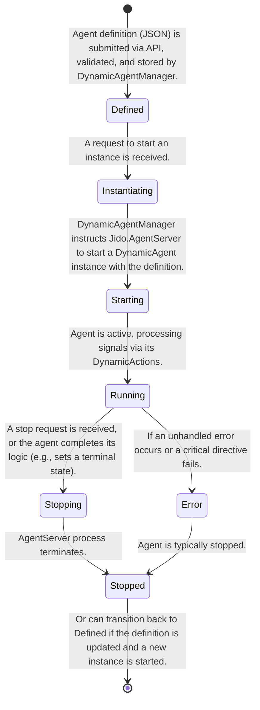
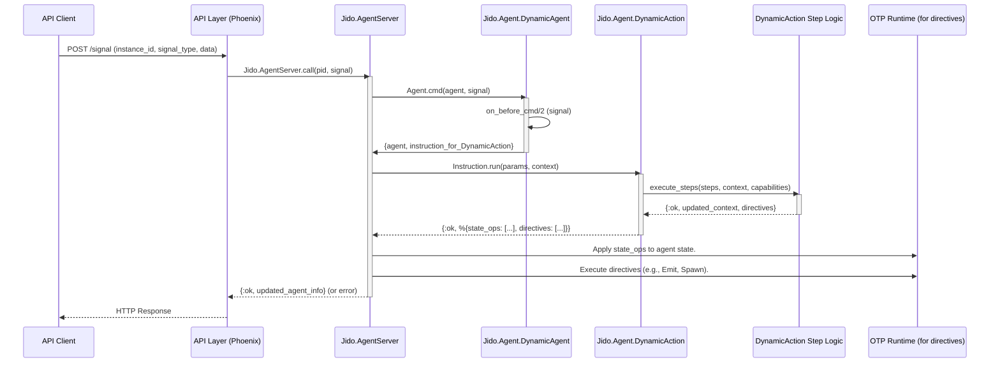

# Jido Dynamic Runtime Platform: Architectural Design

## Introduction

The Jido framework, with its foundation in immutable agent data structures, pure functional command logic via `cmd/2`, and directive-based side effects, provides a robust and deterministic platform for building autonomous workflows in Elixir [[0](https://github.com/agentjido/jido)]. Currently, agent and action definitions are established at compile time, which, while offering performance and safety benefits, limits adaptability in scenarios requiring dynamic agent provisioning. This document outlines a comprehensive architectural design for a Jido Dynamic Runtime Platform, enabling the creation, deployment, management, and control of Jido agents at runtime based on definitions provided in a JSON format. This design prioritizes maintaining Jido's core principles of immutability, testability, and OTP integration while introducing a powerful layer of runtime configurability. Crucially, this architecture incorporates robust security and access control mechanisms to ensure safe operation within potentially untrusted or multi-tenant environments. The proposed solution involves new components such as a `DynamicAgent` host, a `DynamicAction` interpreter, a `DynamicAgentManager` for lifecycle control, and a dedicated API, all working in concert with existing Jido constructs like `Jido.AgentServer` and `Jido.Signal`.

## Core Architectural Components

The Jido Dynamic Runtime Platform is built upon several new, specialized components that integrate with the existing Jido ecosystem. These components handle the parsing, validation, execution, and management of runtime-defined agents and their actions.

### 1. JSON Definition Schemas

The cornerstone of the dynamic platform is a set of JSON schemas that define the structure of agents and their actions at runtime. These schemas must be comprehensive enough to capture all necessary information for instantiation and execution.

**Agent Definition Schema:**
This schema describes a dynamic agent.

```json
{
  "$schema": "http://json-schema.org/draft-07/schema#",
  "title": "Dynamic Agent Definition",
  "type": "object",
  "required": ["name", "version", "actions"],
  "properties": {
    "name": {
      "type": "string",
      "description": "Unique name for the agent type."
    },
    "description": {
      "type": "string",
      "description": "A brief description of the agent's purpose."
    },
    "version": {
      "type": "string",
      "description": "Version of the agent definition (e.g., '1.0.0')."
    },
    "initial_state": {
      "type": "object",
      "description": "The initial state for the agent instance.",
      "default": {}
    },
    "state_schema": {
      "type": "object",
      "description": "Optional Zoi-compatible schema for agent state validation. If omitted, state is a generic map.",
      "default": {}
    },
    "actions": {
      "type": "array",
      "items": { "$ref": "#/definitions/actionDefinition" },
      "description": "A list of actions this agent can perform."
    },
    "capabilities": {
      "type": "array",
      "items": { "type": "string" },
      "description": "A list of capabilities this agent requires (e.g., 'http_access', 'file_read:/tmp')."
    }
  },
  "definitions": {
    "actionDefinition": {
      "type": "object",
      "required": ["name", "steps"],
      "properties": {
        "name": {
          "type": "string",
          "description": "Unique name of the action within this agent."
        },
        "description": {
          "type": "string",
          "description": "A brief description of the action."
        },
        "params_schema": {
          "type": "object",
          "description": "Zoi-compatible schema for validating action parameters.",
          "default": {}
        },
        "steps": {
          "type": "array",
          "items": { "$ref": "#/definitions/stepDefinition" },
          "description": "A sequence of steps defining the action's logic."
        }
      }
    },
    "stepDefinition": {
      "type": "object",
      "required": ["type"],
      "properties": {
        "type": {
          "type": "string",
          "description": "The type of step to execute (e.g., 'set_state', 'emit_signal', 'http_request', 'condition', 'evaluate_expression')."
        },
        "params": {
          "type": "object",
          "description": "Parameters specific to the step type.",
          "default": {}
        },
        "on_error": {
          "type": "string",
          "enum": ["continue", "halt"],
          "default": "halt",
          "description": "Behavior if the step encounters an error."
        }
      }
    }
  }
}
```

**Step Type Examples (within `stepDefinition`):**

*   **`set_state`**: Updates the agent's state.
    ```json
    { "type": "set_state", "params": { "path": "counter", "value": "${params.increment_by + state.counter}" } }
    ```
*   **`emit_signal`**: Dispatches a signal.
    ```json
    { "type": "emit_signal", "params": { "signal_type": "task_completed", "data": { "task_id": "${state.current_task_id}" } } }
    ```
*   **`http_request`**: Makes an HTTP call (requires `http_access` capability).
    ```json
    { "type": "http_request", "params": { "method": "POST", "url": "https://api.example.com/data", "body": "${JSON.encode(state.payload)}" } }
    ```
*   **`condition`**: Conditional branching.
    ```json
    { "type": "condition", "params": { "expression": "${state.status == 'ready'}", "then_steps": [ ... ], "else_steps": [ ... ] } }
    ```
*   **`evaluate_expression`**: Evaluates a simple, sandboxed expression.
    ```json
    { "type": "evaluate_expression", "params": { "expression": "${state.list1 ++ state.list2}", "assign_to": "state.merged_list" } }
    ```
*   **`spawn_agent`**: Spawns a child agent (dynamic or static).
    ```json
    { "type": "spawn_agent", "params": { "agent_module": "Jido.Agent.DynamicAgent", "agent_def_ref": "child_agent_config", "id": "child_123" } }
    ```
    The `agent_def_ref` could be a key to another agent definition provided in the same API call or a known identifier.

### 2. `Jido.Agent.DynamicAgent`

This module serves as a generic host for runtime-defined agent behaviors. It implements the `Jido.Agent` behavior but is configured dynamically.

```elixir
defmodule Jido.Agent.DynamicAgent do
  @moduledoc """
  A generic Jido agent that hosts runtime-defined actions and behaviors
  specified by a JSON-based agent definition.
  """
  use Jido.Agent,
    name: "dynamic_agent_host",
    description: "Host for runtime-defined agent logic",
    schema: [
      # The agent's state will largely be managed by the dynamic definition.
      # This schema might be very basic or adapt based on the loaded definition.
      _dynamic_definition: [type: :map, required: true, doc: "The parsed JSON agent definition."],
      _dynamic_state: [type: :map, default: %{}, doc: "The actual state of the dynamic agent."]
    ]

  alias Jido.Agent
  alias Jido.Signal
  alias Jido.Instruction
  alias Jido.Agent.DynamicAction

  @impl true
  def new(opts) do
    # Ensure _dynamic_definition is provided, typically from the API layer.
    # The initial _dynamic_state might be seeded from the definition's "initial_state".
    super(opts)
  end

  @impl true
  def on_before_cmd(%Agent{} = agent, %Signal{type: signal_type} = signal) do
    # This hook is crucial for routing signals to the correct dynamic action.
    definition = agent.state._dynamic_definition
    action_definitions = definition["actions"] || []

    case Enum.find(action_definitions, fn action_def -> action_def["name"] == signal_type end) do
      nil ->
        # If no dynamic action matches, we can either let it pass through (perhaps to a plugin)
        # or return an error directive.
        Logger.warning("DynamicAgent: No action found for signal type: #{signal_type}")
        {agent, signal} # Pass through, might be handled by a plugin or result in a default error.

      action_def ->
        # Transform the signal into an instruction for our DynamicAction runner.
        instruction = %Instruction{
          action: DynamicAction,
          params: %{
            action_definition: action_def,
            original_signal: signal,
            agent_capabilities: definition["capabilities"] || []
          },
          # Context can be enriched if needed, e.g., with tenant info from agent metadata
          context: %{dynamic_agent_id: agent.id}
        }
        {agent, instruction}
    end
  end

  @impl true
  def on_before_cmd(%Agent{} = agent, action), do: {agent, action}

  # The cmd/2 function itself will be the one from Jido.Agent.
  # It will receive the Instruction from on_before_cmd and call DynamicAction.run/2.
end
```

### 3. `Jido.Agent.DynamicAction`

This module implements the `Jido.Action` behavior and acts as an interpreter for the serialized action logic defined in JSON.

```elixir
defmodule Jido.Agent.DynamicAction do
  @moduledoc """
  A Jido action that interprets and executes serialized logic
  defined in JSON-based action definitions.
  """
  use Jido.Action,
    name: "dynamic_action_interpreter",
    description: "Interprets and executes dynamic action steps",
    schema: [
      action_definition: [type: :map, required: true, doc: "The parsed JSON action definition."],
      original_signal: [type: :map, required: true, doc: "The original signal that triggered this action."],
      agent_capabilities: [type: {:list, :string}, default: [], doc: "Capabilities of the hosting agent."]
    ]

  alias Jido.Agent.{Directive, State, StateOp}
  require Logger

  @impl true
  def run(params, context) do
    %{action_definition: action_def, original_signal: signal, agent_capabilities: capabilities} = params
    %{agent: current_agent_struct} = context # Access to the agent struct and its state

    # 1. Validate parameters against action_def["params_schema"]
    # This would involve a runtime schema validator (e.g., Zoi if it supports it, or a custom one).
    # For simplicity, we assume signal.data contains the validated params for now.
    # validated_params = validate_params(signal.data, action_def["params_schema"])

    # 2. Prepare execution context for steps
    # This context includes agent state, signal data, and potentially utility functions.
    # It's crucial for evaluating expressions like "${state.counter}".
    exec_context = %{
      "state" => current_agent_struct.state._dynamic_state,
      "params" => signal.data, # Parameters from the incoming signal
      "signal" => %{"type" => signal.type, "source" => signal.source},
      # Add safe versions of JSON, Math, etc. for evaluate_expression
      "JSON" => Jason, # Or a safer wrapper
      "Math" => :math
    }

    # 3. Execute steps sequentially
    case execute_steps(action_def["steps"], exec_context, capabilities, []) do
      {:ok, final_context, directives} ->
        # 4. Return new state (via StateOp) and any generated directives
        new_dynamic_state = final_context["state"]
        state_ops = [%StateOp.SetState{path: [:_dynamic_state], value: new_dynamic_state}]
        {:ok, %{state_ops: state_ops, directives: directives}}

      {:error, reason} ->
        # Return an error directive
        error_directive = %Directive.Error{error: reason}
        {:ok, %{directives: [error_directive]}}
    end
  end

  defp execute_steps([], context, _capabilities, directives), do: {:ok, context, directives}

  defp execute_steps([step_def | rest], context, capabilities, accumulated_directives) do
    case execute_single_step(step_def, context, capabilities) do
      {:ok, new_context, new_directives} ->
        all_directives = accumulated_directives ++ new_directives
        execute_steps(rest, new_context, capabilities, all_directives)

      {:error, reason} when step_def["on_error"] == "continue" ->
        Logger.warning("DynamicAction step failed but continuing: #{inspect(reason)}")
        execute_steps(rest, context, capabilities, accumulated_directives)

      {:error, reason} ->
        {:error, reason}
    end
  end

  defp execute_single_step(%{"type" => "set_state", "params" => params}, context, _capabilities) do
    # params["path"] could be "key" or "nested.key"
    # params["value"] might be a literal or an expression like "${state.value + 1}"
    path = String.split(params["path"], ".") |> Enum.map(&String.to_atom/1)
    value = evaluate_expression(params["value"], context)

    new_state = StateHelper.set_in(context["state"], path, value)
    {:ok, %{context | "state" => new_state}, []}
  end

  defp execute_single_step(%{"type" => "emit_signal", "params" => params}, context, capabilities) do
    signal_type = evaluate_expression(params["signal_type"], context)
    signal_data = evaluate_expression(params["data"], context) # data can be an object with expressions

    # Check if emitting this signal type is allowed by capabilities
    if "signal_emit:#{signal_type}" in capabilities or "signal_emit:*" in capabilities do
      signal = %Signal{
        type: signal_type,
        data: signal_data,
        source: "dynamic_action:#{context["signal"]["type"]}" # Or a more specific source
      }
      directive = %Directive.Emit{signal: signal}
      {:ok, context, [directive]}
    else
      {:error, "Capability 'signal_emit:#{signal_type}' not granted."}
    end
  end

  # ... implementations for other step types like http_request, condition, evaluate_expression, spawn_agent ...
  # Each step type must respect the agent's capabilities.

  defp execute_single_step(%{"type" => unknown_type, "params" => _params}, _context, _capabilities) do
    {:error, "Unknown dynamic action step type: #{unknown_type}"}
  end

  # evaluate_expression/2 would parse strings like "${...}" and evaluate them safely
  # against the context. This is a critical security-sensitive function.
  # It should likely use a dedicated, sandboxed expression evaluator.
  defp evaluate_expression(value, _context) when is_number(value) or is_binary(value) or is_boolean(value) or is_nil(value), do: value
  defp evaluate_expression(value, context) when is_map(value), do: Map.new(value, fn {k,v} -> {k, evaluate_expression(v, context)} end)
  defp evaluate_expression(value, context) when is_list(value), do: Enum.map(value, &evaluate_expression(&1, context))
  defp evaluate_expression(expr_str, context) when is_binary(expr_str) do
    # Regex to find ${...} patterns
    # This is a simplified placeholder. A real implementation needs a proper parser
    # and a safe evaluation environment (e.g., using `Code.eval_string/3` with a tight
    # bindings list and no access to dangerous modules, or a dedicated expression language).
    Regex.replace(~r/\$\{([^}]+)\}/, expr_str, fn _whole_match, inner_expr ->
      try do
        # EXTREME CAUTION: Code.eval_string is dangerous if not sandboxed properly.
        # This example is illustrative. A production system needs a secure expression evaluator.
        # The bindings should be *only* what's in the context.
        {result, _} = Code.eval_string(inner_expr, [context: context, state: context["state"], params: context["params"], JSON: context["JSON"], Math: context["Math"]], __ENV__)
        result
      rescue
        e -> raise "Error evaluating expression '#{inner_expr}': #{inspect(e)}"
      end
    end)
  end
  defp evaluate_expression(other, _context), do: other
end
```

### 4. `Jido.Agent.DynamicAgentManager`

This GenServer is responsible for the overall lifecycle management of dynamic agent definitions and their instances. It would handle parsing, validating, and storing agent definitions, and orchestrating the creation and supervision of `Jido.AgentServer` instances for `DynamicAgent`.

```elixir
defmodule Jido.Agent.DynamicAgentManager do
  use GenServer
  require Logger

  # Client API
  def start_link(opts \\ []), do: GenServer.start_link(__MODULE__, opts, name: __MODULE__)

  def deploy_agent_definition(agent_def_json, opts \\ []) do
    GenServer.call(__MODULE__, {:deploy_definition, agent_def_json, opts}, :infinity)
  end

  def start_agent_instance(agent_type_id, instance_id, opts \\ []) do
    GenServer.call(__MODULE__, {:start_instance, agent_type_id, instance_id, opts}, :infinity)
  end

  def stop_agent_instance(instance_id), do: GenServer.call(__MODULE__, {:stop_instance, instance_id})

  def get_agent_definition(agent_type_id), do: GenServer.call(__MODULE__, {:get_definition, agent_type_id})

  def list_agent_instances(agent_type_id \\ nil), do: GenServer.call(__MODULE__, {:list_instances, agent_type_id})

  # Server Callbacks
  @impl true
  def init(_opts) do
    # This could be backed by ETS, DETS, or a database for persistence
    state = %{
      definitions: %{}, # %{ "agent_type@version" => parsed_definition }
      instances: %{}    # %{ "instance_id" => %{pid: pid, agent_type_id: "agent_type@version", status: :running} }
    }
    {:ok, state}
  end

  @impl true
  def handle_call({:deploy_definition, agent_def_json, _opts}, _from, state) do
    # 1. Parse and validate JSON against the Agent Definition Schema
    # 2. Store the validated definition: definitions["#{name}@#{version}"] = def
    # 3. Potentially notify interested parties or trigger instance updates
    # For now, just parse and store.
    try do
      agent_def = Jason.decode!(agent_def_json)
      # TODO: Add schema validation here
      key = "#{agent_def["name"]}@#{agent_def["version"]}"
      new_definitions = Map.put(state.definitions, key, agent_def)
      {:reply, {:ok, key}, %{state | definitions: new_definitions}}
    rescue
      e in Jason.DecodeError -> {:reply, {:error, "Invalid JSON: #{e.message}"}, state}
      # other validation errors...
    end
  end

  @impl true
  def handle_call({:start_instance, agent_type_id, instance_id, opts}, _from, state) do
    case Map.get(state.definitions, agent_type_id) do
      nil ->
        {:reply, {:error, :definition_not_found}, state}

      agent_def ->
        # Ensure unique instance_id or generate one
        agent_server_opts = [
          agent: Jido.Agent.DynamicAgent,
          id: instance_id,
          initial_state: %{
            _dynamic_definition: agent_def,
            _dynamic_state: agent_def["initial_state"] || %{}
          }
          # Add other Jido.AgentServer options from opts, like registry, parent, etc.
        ]

        case Jido.AgentServer.start_link(agent_server_opts) do
          {:ok, pid} ->
            new_instances = Map.put(state.instances, instance_id, %{pid: pid, agent_type_id: agent_type_id, status: :running})
            {:reply, {:ok, pid}, %{state | instances: new_instances}}
          {:error, reason} ->
            {:reply, {:error, reason}, state}
        end
    end
  end

  @impl true
  def handle_call({:stop_instance, instance_id}, _from, state) do
    case Map.get(state.instances, instance_id) do
      %{pid: pid} ->
        Jido.AgentServer.stop(pid) # Or send a stop signal
        new_instances = Map.delete(state.instances, instance_id)
        {:reply, :ok, %{state | instances: new_instances}}
      nil ->
        {:reply, {:error, :instance_not_found}, state}
    end
  end

  # ... other handle_call implementations for get_definition, list_instances, etc.
end
```

### 5. API Layer (e.g., Phoenix/Plug)

This layer exposes HTTP endpoints for interacting with the `DynamicAgentManager` and individual dynamic agent instances.

```elixir
# Example using Phoenix controllers
defmodule JidoWeb.DynamicAgentController do
  use JidoWeb, :controller

  # POST /api/v1/dynamic_agents/definitions
  def create_definition(conn, %{"definition" => def_json}) do
    # AuthN/AuthZ plugs should have run before this
    case DynamicAgentManager.deploy_agent_definition(def_json) do
      {:ok, agent_type_id} -> json(conn, %{status: "deployed", agent_type_id: agent_type_id})
      {:error, reason} -> put_status(conn, :bad_request) |> json(%{error: reason})
    end
  end

  # POST /api/v1/dynamic_agents/instances
  def create_instance(conn, %{"agent_type_id" => agent_type_id, "instance_id" => instance_id} = params) do
    opts = Map.take(params, ["initial_state_override"]) # Or other options
    case DynamicAgentManager.start_agent_instance(agent_type_id, instance_id, opts) do
      {:ok, _pid} -> json(conn, %{status: "started", instance_id: instance_id})
      {:error, reason} -> put_status(conn, :bad_request) |> json(%{error: reason})
    end
  end

  # DELETE /api/v1/dynamic_agents/instances/:id
  def delete_instance(conn, %{"id" => instance_id}) do
    case DynamicAgentManager.stop_agent_instance(instance_id) do
      :ok -> json(conn, %{status: "stopped", instance_id: instance_id})
      {:error, reason} -> put_status(conn, :not_found) |> json(%{error: reason})
    end
  end

  # POST /api/v1/dynamic_agents/instances/:id/signal
  def send_signal(conn, %{"id" => instance_id, "signal" => signal_params}) do
    # Validate signal_params against a basic schema (type, data)
    signal = %Signal{
      type: signal_params["type"],
      data: signal_params["data"] || %{},
      source: "api_user" # Or identify the actual user/principal
    }
    case Jido.AgentServer.whereis(instance_id) do # Assuming a registry is configured
      nil -> put_status(conn, :not_found) |> json(%{error: "Agent instance not found"})
      pid ->
        case Jido.AgentServer.call(pid, signal) do # Or cast for async
          {:ok, _agent} -> json(conn, %{status: "signal_processed"}) # Could return part of state
          {:error, reason} -> put_status(conn, :bad_request) |> json(%{error: reason})
        end
    end
  end

  # GET /api/v1/dynamic_agents/instances/:id/state
  def get_state(conn, %{"id" => instance_id}) do
    case Jido.AgentServer.whereis(instance_id) do
      nil -> put_status(conn, :not_found) |> json(%{error: "Agent instance not found"})
      pid ->
        case Jido.AgentServer.state(pid) do
          {:ok, agent_server_state} ->
            # agent_server_state.agent.state will contain the _dynamic_state
            json(conn, %{state: agent_server_state.agent.state._dynamic_state})
          {:error, reason} -> put_status(conn, :internal_server_error) |> json(%{error: reason})
        end
    end
  end
end
```

## Security and Access Control Architecture

Security is paramount for a dynamic runtime platform. The architecture must prevent malicious or poorly defined agents from compromising the system.

### Authentication and Authorization

Authentication verifies the identity of API consumers, while authorization determines their permissions.

*   **Authentication**: Implement standard mechanisms like API keys, OAuth2 tokens, or JWTs. Phoenix plugs are ideal for this.
    ```elixir
    # Example Plug
    defmodule JidoWeb.Plugs.Authenticate do
      import Plug.Conn
      def init(opts), do: opts
      def call(conn, _opts) do
        # Extract token from header, cookie, etc.
        # Verify token (e.g., with Jido.Auth)
        # If valid, assign current_user/subject to conn
        # If invalid, halt with 401
        assign(conn, :current_subject, %{id: "user123", roles: ["dynamic_agent_user"]})
      end
    end
    ```
*   **Authorization (Attribute-Based Access Control - ABAC)**:
    *   **Subjects**: Authenticated users or services.
    *   **Resources**: Agent definitions, agent instances, API endpoints.
    *   **Actions**: Deploy, start, stop, signal, read state.
    *   **Policies**: Rules like "Users with role 'admin' can deploy any agent definition" or "A user can only start/stop/signal agents they created or are explicitly granted access to, and only if the agent definition's required capabilities are a subset of the user's granted capabilities."
    *   This can be implemented using libraries like `Bodyguard` or a custom policy module.

### Capability-Based Security for Agents

Dynamic agents operate within a sandbox defined by their granted capabilities. This limits their access to system resources.

*   **Agent Definition Capabilities**: The JSON schema includes an optional `capabilities` list (e.g., `["http_get", "signal_emit:*", "file_read:/allowed/path"]`).
*   **User/Subject Capabilities**: Authenticated subjects are also granted a set of capabilities.
*   **Capability Checking**:
    *   At deployment: The `DynamicAgentManager` (or an authz layer) checks if the deploying subject has permissions to deploy agents with the requested capabilities.
    *   At runtime: The `DynamicAction` interpreter checks if a specific step (e.g., `http_request`) is allowed by the agent's `capabilities` list before execution.
    ```elixir
    # In DynamicAction.run/2 or execute_single_step/4
    defp check_capability(capabilities, required_capability) do
      if required_capability in capabilities or Enum.any?(capabilities, &String.ends_with?(&1, "*")) do
        :ok
      else
        {:error, "Capability '#{required_capability}' not granted."}
      end
    end
    ```

### Sandboxing of Dynamic Action Logic

Executing arbitrary logic, even if defined in JSON, is risky. The `DynamicAction` interpreter must be a robust sandbox.

*   **Restricted Step Types**: Only a predefined, safe set of step types is available. Steps for direct OS command execution or unsafe Erlang/Elixir functions should be excluded or heavily guarded.
*   **Safe Expression Evaluation**: The `evaluate_expression/2` function in `DynamicAction` is a critical attack vector.
    *   **Avoid `Code.eval_string/2` for Untrusted Input**: If used, it must be with extremely restrictive bindings and potentially within a isolated process (e.g., a pool of short-lived, sandboxed processes with limited memory and message queue size).
    *   **Dedicated Expression Language**: Consider using a purpose-built, sandboxed expression evaluator (e.g., a custom parser/interpreter for a limited DSL, or a library like `Expr` if it can be configured safely).
    *   **No Access to Dangerous Modules**: The evaluation context must not include `System`, `File`, `Code`, `Port`, etc., unless explicitly allowed by a very specific capability.
*   **Resource Limits**:
    *   **Execution Timeouts**: Each `DynamicAction.run/2` call or individual step execution should have a timeout.
    *   **Memory Quotas**: Consider using BEAM's process memory limit features or monitoring agent processes.
    *   **Rate Limiting**: API calls and agent signal processing should be rate-limited.

### Input Validation and Sanitization

All incoming JSON definitions and signal data must be rigorously validated.

*   **JSON Schema Validation**: Use a library like `ExJsonSchema` to validate incoming agent and action definitions against their respective schemas before processing.
    ```elixir
    # In DynamicAgentManager
    defp validate_agent_definition(json_string) do
      # Load schema (e.g., from a file or module attribute)
      schema = load_agent_definition_schema()
      with {:ok, agent_def_map} <- Jason.decode(json_string),
           :ok <- ExJsonSchema.Validator.validate(schema, agent_def_map) do
        {:ok, agent_def_map}
      else
        {:error, %Jason.DecodeError{} = e} -> {:error, "Invalid JSON: #{e.message}"}
        {:error, validation_errors} -> {:error, "Schema validation failed: #{inspect(validation_errors)}"}
      end
    end
    ```
*   **Parameter Sanitization**: Even within validated structures, be wary of deeply nested or unexpectedly large data structures that could lead to memory exhaustion or performance issues.

### Secure Communication

*   **HTTPS**: All API communication must be over TLS.
*   **Sensitive Data**: Avoid logging sensitive parts of agent definitions or state. Ensure any persistence of agent definitions or state is encrypted if it contains sensitive information.

## Data Flow and Lifecycle Management

### Agent Lifecycle



### Signal Processing Flow



### API Endpoint Design Summary

| Endpoint                                      | Method | Purpose                                                                 | Security Considerations                                   |
| --------------------------------------------- | ------ | ----------------------------------------------------------------------- | --------------------------------------------------------- |
| `/api/v1/dynamic_agents/definitions`          | `POST` | Deploy a new agent definition (JSON).                                   | AuthN, AuthZ (can deploy def with requested capabilities), Input Validation |
| `/api/v1/dynamic_agents/definitions/:id`      | `GET`  | Retrieve a specific agent definition.                                    | AuthN, AuthZ (can read this definition)                   |
| `/api/v1/dynamic_agents/instances`           | `POST` | Start a new instance of a deployed agent definition.                    | AuthN, AuthZ (can start instance of this def), Input Validation |
| `/api/v1/dynamic_agents/instances/:id`        | `GET`  | Get status or basic info about an instance.                             | AuthN, AuthZ (can access this instance)                   |
| `/api/v1/dynamic_agents/instances/:id/state` | `GET`  | Get the current dynamic state of an instance.                           | AuthN, AuthZ (can read state of this instance)            |
| `/api/v1/dynamic_agents/instances/:id/signal` | `POST` | Send a signal to a running agent instance.                             | AuthN, AuthZ (can signal this instance), Input Validation (signal format) |
| `/api/v1/dynamic_agents/instances/:id`        | `DELETE` | Stop a running agent instance.                                        | AuthN, AuthZ (can stop this instance)                    |

## Integration with Existing Jido Ecosystem

The dynamic runtime platform is designed to extend, not replace, existing Jido functionality.

*   **`Jido.AgentServer`**: Remains the core OTP runtime for *all* Jido agents, including `DynamicAgent` instances. It handles supervision, signal routing, and directive execution as usual.
*   **`Jido.Signal`**: The standard communication mechanism. Dynamic agents send and receive `Jido.Signal` structs.
*   **`Jido.Directive`**: Dynamic actions return standard Jido directives (`Emit`, `SpawnAgent`, `Stop`, etc.), which `Jido.AgentServer` processes. This allows dynamic agents to interact with the broader Jido ecosystem, including spawning static agents or other dynamic agents.
*   **`Jido.Bus`**: Signals emitted by dynamic agents can be routed via `Jido.Bus` and its adapters (e.g., PubSub) to other agents or external systems.
*   **Persistence**: If `Jido.Persistence` features are used, the state of `DynamicAgent` instances (specifically their `_dynamic_state` and potentially a reference to their definition) could be persisted and restored.
*   **Plugins**: It might be possible in the future to allow dynamic agents to reference or be extended by *statically defined* Jido plugins, if a safe mechanism for plugin discovery and invocation from dynamic code is established.

## Error Handling and Observability

Robust error handling and observability are critical for managing a system with dynamically defined behavior.

*   **Structured Logging**: All components (`DynamicAgentManager`, `DynamicAction` interpreter, API layer) should use structured logging (e.g., `Logger`) with relevant context (agent ID, action name, step type, error details).
*   **Telemetry**: Leverage Jido's existing `:telemetry` integration [[3](https://github.com/agentjido/jido/blob/main/lib/jido/agent_server.ex)]. Dynamic action execution should emit telemetry events for:
    *   Action start/stop (with duration, success/failure status).
    *   Individual step execution start/stop (with duration, success/failure).
    *   Errors encountered during JSON parsing, validation, or executions.
*   **AgentServer Debug Mode**: The existing debug mode in `Jido.AgentServer` [[3](https://github.com/agentjido/jido/blob/main/lib/jido/agent_server.ex)] will be invaluable for tracing signal processing and directive execution for dynamic agents.
*   **Error Directives**: `DynamicAction` should return `%Directive.Error{}` when unrecoverable errors occur during its logic, allowing `AgentServer` to handle them according to its configured error policy.
*   **API Error Responses**: The API layer must return clear, standardized error messages and appropriate HTTP status codes, including details about validation failures or execution errors from dynamic agents, while being careful not to leak sensitive internal details.
*   **Monitoring Dashboards**: Set up dashboards (e.g., using Prometheus/Grafana with BEAM telemetry exporters) to monitor the number of dynamic agents, their resource usage, action execution success rates, and error frequencies.

## Conclusion and Future Work

The proposed Jido Dynamic Runtime Platform architecture provides a comprehensive blueprint for enabling the creation and management of Jido agents at runtime. By defining agents and their actions through a JSON schema, and introducing components like `DynamicAgent` and `DynamicAction` to host and interpret these definitions, Jido gains significant flexibility for building adaptive and extensible systems. The layered security approach, encompassing authentication, authorization, capability-based controls, and sandboxing, is fundamental to ensuring that this dynamism does not compromise system integrity.

This architecture allows Jido to evolve towards a more platform-like capability, where agent behaviors can be configured and deployed without application recompilation. This opens up possibilities for user-defined automations, plugin architectures, and systems that adapt their agent logic based on real-time requirements.

**Future Work and Enhancements:**

*   **Persistence and Versioning of Definitions**: Implementing a robust store for agent definitions, supporting versioning, and allowing agents to be recreated from persisted definitions.
*   **Visual Agent Builder**: A UI that allows users to visually design agent workflows, which then generate the corresponding JSON definitions.
*   **AI-Driven Agent Generation**: Leveraging LLMs to generate initial JSON agent definitions from natural language descriptions.
*   **Advanced Expression Language**: Developing a richer, but still safe, expression language for dynamic action steps, potentially with custom functions.
*   **Hot-Reloading of Agent Definitions**: Exploring mechanisms to update the definition of a running dynamic agent without stopping it, for zero-downtime updates.
*   **Fine-Grained Resource Quotas**: Implementing more sophisticated resource management (CPU, memory, network bandwidth) for dynamic agents, especially in multi-tenant environments.
*   **Dynamic Plugin System for Steps**: Allowing new, secure step types to be added to the `DynamicAction` interpreter dynamically, perhaps through a vetted plugin mechanism.

By pursuing this architectural direction, Jido can solidify its position as a powerful and versatile framework for building the next generation of intelligent, autonomous, and dynamically configurable systems in Elixir.

# Reference List

[0] jido. https://github.com/agentjido/jido.

[1] jido_action. https://github.com/agentjido/jido_action.

[2] jido/lib/jido/agent.ex at main · agentjido/jido. https://github.com/agentjido/jido/blob/main/lib/jido/agent.ex.

[3] jido/lib/jido/agent_server.ex at main · agentjido/jido. https://github.com/agentjido/jido/blob/main/lib/jido/agent_server.ex.
